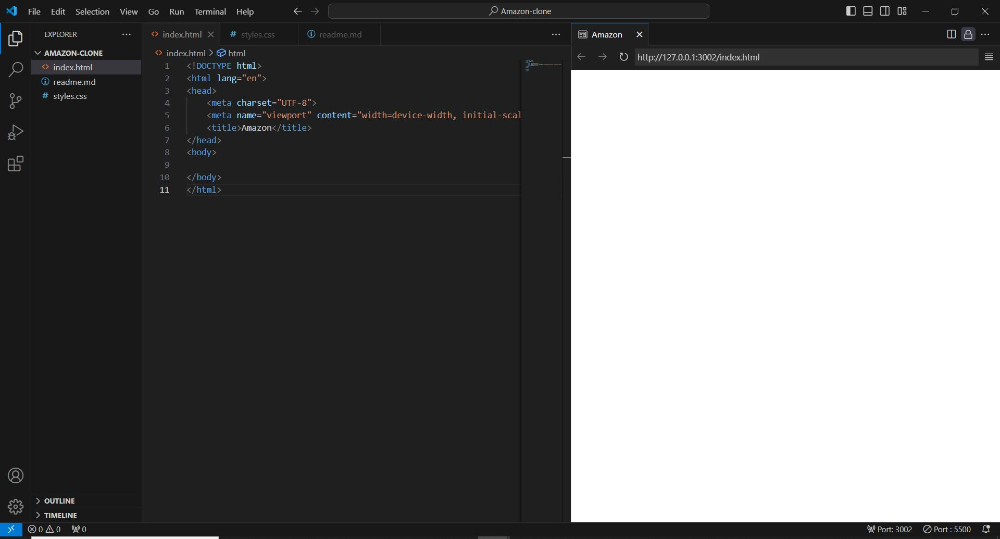
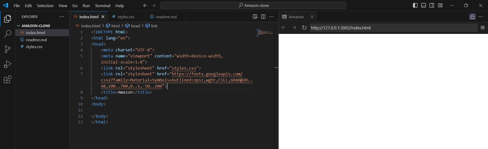
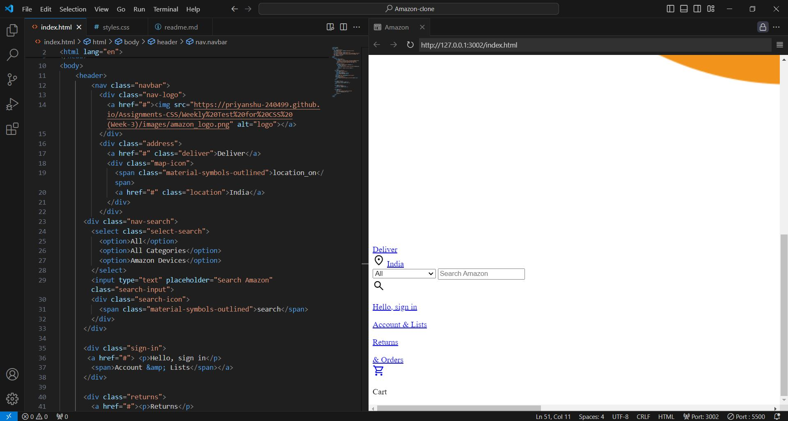
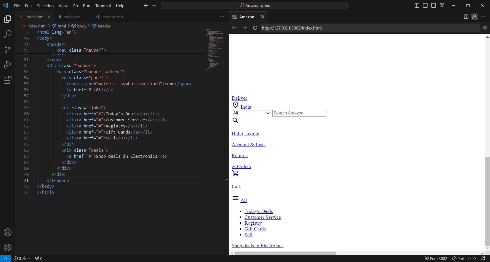
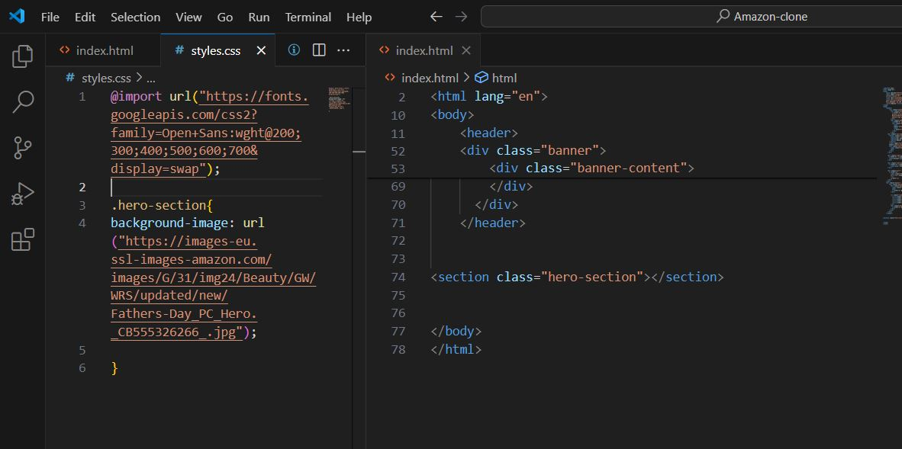
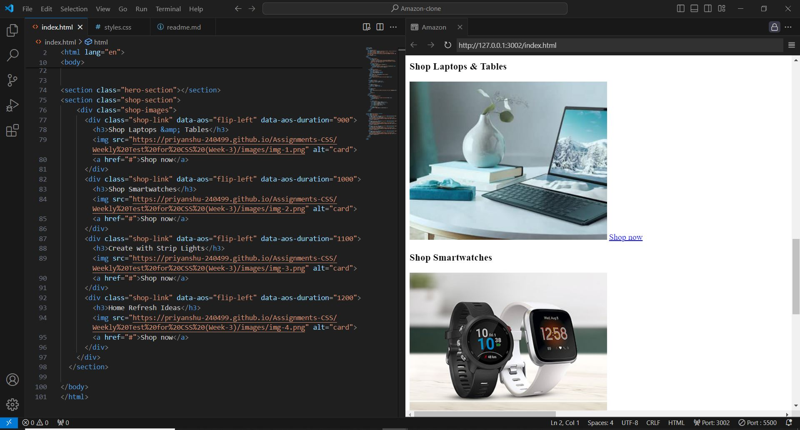

**# Amazon Clone Project**

## Introduction
This project is a simple clone of the Amazon website, built using HTML and CSS. It includes a responsive header, a banner section, a shop section with product links, and a footer with various links. The project is styled to resemble Amazon's aesthetic and includes basic functionality such as navigation and search input.

## Project Structure
The project consists of the following main files:
- `index.html`: The main HTML file containing the structure of the webpage.
- `styles.css`: The CSS file for styling the webpage.

## Step-by-Step Guide

### Step 1: Setting Up the HTML File

1. **Basic HTML Structure**
    - Create a file named `index.html`.
    - Set up the basic HTML structure with `<!DOCTYPE html>`, `<html>`, `<head>`, and `<body>` tags.
    - Add the necessary metadata such as character set and viewport settings.
    
## Screenshot

2. **Include External Resources**
    - Link the Google Fonts stylesheet for the "Open Sans" font.
    - Link the Material Symbols Outlined for the icons.
    - Link the `styles.css` file for styling.

3. **Header Section**
    - Create a `<header>` element.
    - Inside the header, create a `<nav>` element with the class `navbar`.
    - Add the Amazon logo inside a `div` with the class `nav-logo`.
    - Create the address section with a link for delivery and location.
    - Add a search bar with a dropdown for categories, an input field, and a search icon.
    - Include links for signing in, returns, and the cart.

4. **Banner Section**
    - Create a `
` with the class `banner`.
    - Inside it, create a `
` with the class `banner-content`.
    - Add a navigation panel and a list of links such as "Today's Deals", "Customer Service", etc.

5. **Hero Section**
    - Create a `<section>` with the class `hero-section`.
    - Add a background image to the hero section.

6. **Shop Section**
    - Create a `<section>` with the class `shop-section`.
    - Inside it, create a `div` with the class `shop-images`.
    - Add individual product links with the class `shop-link`, each containing an image, title, and a "Shop now" link.

7. **Footer Section**
    - Create a `<footer>` element.
    - Add a link with the class `footer-title` for "Back to top".
    - Create a `div` with the class `footer-items` and add multiple lists containing links for different sections like "Get to Know Us", "Connect with Us", etc.

### Step 2: Styling with CSS

1. **Global Styles**
    - Create a file named `styles.css`.
    - Import the "Open Sans" font.
    - Reset margin and padding for all elements using `*` selector.
    - Set `box-sizing: border-box` and a default font family.

2. **Header Styles**
    - Style the `header` to have a background color of `#0f1111` and full width.
    - Style the `navbar` to be a flex container with space between items, center alignment, and a max width of `1280px`.

3. **Logo and Address**
    - Style the logo image to have a margin-top and specific width.
    - Style the address section with small font sizes and color `#ccc`.

4. **Search Bar**
    - Style the search bar to be a flex container with a background color of `#f3f3f3`, specific width, and border-radius.
    - Style the dropdown, input field, and search icon with appropriate sizes and colors.

5. **Sign-in, Returns, and Cart**
    - Style these sections with smaller font sizes and font weights.
    - Style the cart icon to have a larger font size.

6. **Banner Styles**
    - Style the `banner` with padding and background color `#222f3d`.
    - Style the `banner-content` to be a flex container with space between items.

7. **Hero Section Styles**
    - Style the `hero-section` with a height of `400px` and a background image with specific positioning.

8. **Shop Section Styles**
    - Style the `shop-section` to be a flex container with center alignment, column direction, and padding.
    - Style the `shop-images` to be a grid with responsive columns.
    - Style individual `shop-link` items with background color, padding, and transition effects for scaling and hovering.

9. **Footer Styles**
    - Style the `footer-title` with background color `#37475a` and center alignment.
    - Style the `footer-items` to be a flex container with even spacing and background color `#232f3e`.
    - Style individual footer links with appropriate font sizes and colors.

## Conclusion
By following these steps, you can create a basic Amazon clone with a structured layout and styling similar to the original website. This project helps in understanding the use of HTML and CSS to create a responsive and visually appealing web page.
